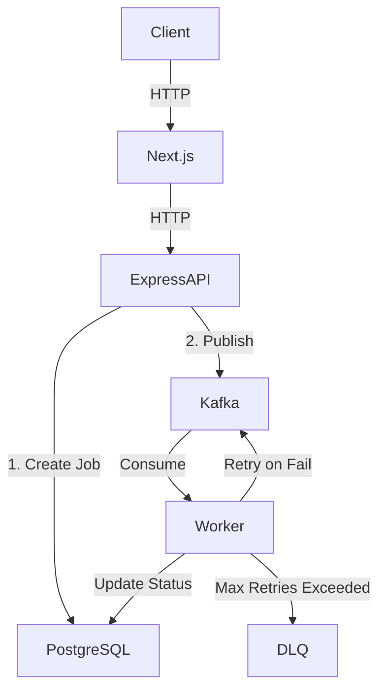

# Architecture Overview

This project implements a scalable background job processing system.

## System Overview
- **Next.js Web App**: User interface to trigger and monitor jobs.
- **Express API**: Receives HTTP requests, creates a job record in the database, and publishes an event to Kafka.
- **Kafka**: Acts as the message broker, with topics for standard jobs and DLQ for failed messages.
- **Workers**: Listen to Kafka topics, process jobs, handle retries, and publish to DLQ if max retries are exceeded.
- **PostgreSQL**: Stores canonical job state.

## Architecture Diagram

## Request Flow
1. Client requests a job (e.g. `SEND_EMAIL`).
2. Express validates it, inserts a `PENDING` job into Postgres.
3. Express publishes the job metadata to Kafka topic `jobs.send-email`.
4. API returns Job ID to the client.

## Kafka Architecture
- Topics per job type (or category).
- DLQ topics for messages that fail permanently.
- Partitions allow horizontal scaling of workers within consumer groups.

## Worker Architecture
Worker has a clean separation:
Kafka Consumer -> Message Deserializer -> Job Router -> Job Handler
Success -> Mark Completed
Failure -> Retry Manager -> DLQ Producer

## Database Architecture
Prisma is used with PostgreSQL. `Job` model holds state, payload, attempts, and timestamps.

## Idempotency
Each job has a unique UUID. Workers check Postgres state before processing to prevent duplicate side effects in case of at-least-once delivery duplicates.
